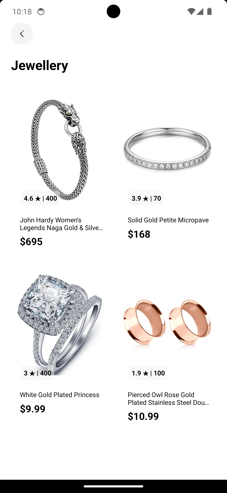

# Learning React Native 

## Project Overview

This project is named **clot** and is built using the following technologies and libraries:

### Tech Stack

- **Framework**: [Expo](https://expo.dev/)
- **React Native Version**: 0.74.3
- **React Version**: 18.2.0
- **Navigation**:
  - [React Navigation](https://reactnavigation.org/): 6.1.18
  - [React Navigation Bottom Tabs](https://reactnavigation.org/docs/bottom-tab-navigator/): 6.6.1
  - [React Navigation Stack](https://reactnavigation.org/docs/stack-navigator/): 6.4.0
- **State Management**:
  - [Async Storage](https://react-native-async-storage.github.io/async-storage/): 1.24.0
- **UI Components**:
  - [React Native Vector Icons](https://oblador.github.io/react-native-vector-icons/): 10.1.0
  - [React Native SVG Transformer](https://github.com/kristerkari/react-native-svg-transformer): 1.5.0
- **Secure Storage**: [Expo Secure Store](https://docs.expo.dev/versions/latest/sdk/securestore/): 13.0.2
- **HTTP Requests**: [Axios](https://axios-http.com/): 1.7.2
- **Testing**:
  - [Jest](https://jestjs.io/): 29.7.0
  - [Jest-Expo](https://github.com/expo/jest-expo): 51.0.3

### Backend

The backend for this project is powered by [Fake Store API](https://fakestoreapi.com/docs). This API provides a range of endpoints for managing and retrieving product data, which is used to support various features in the app.

### Screenshots

#### Splash

#### Homepage

#### Profile

#### Cart

#### Electronics

#### Jewellery

#### Create Account

  
  

#### Sign In

  
  

